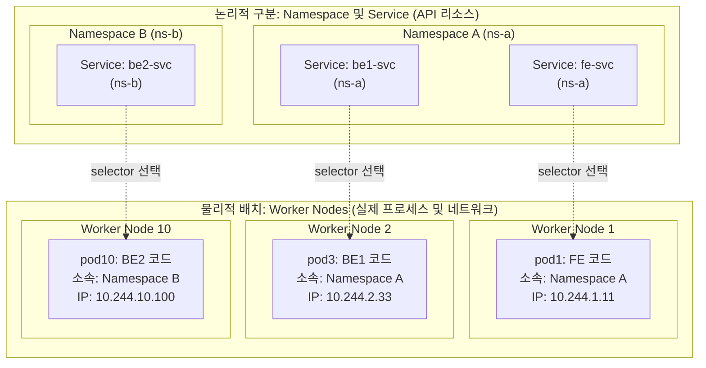
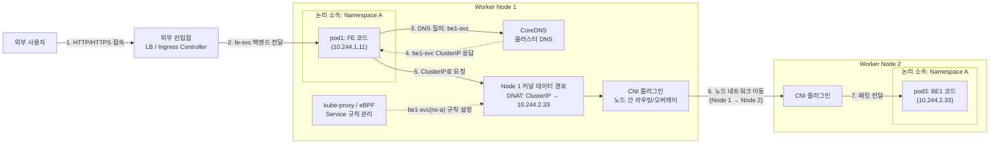
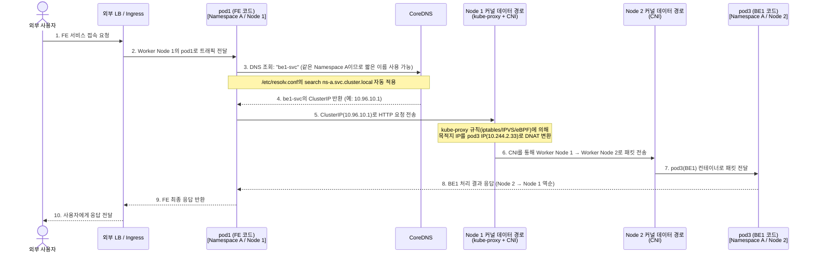
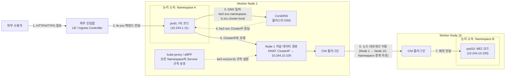
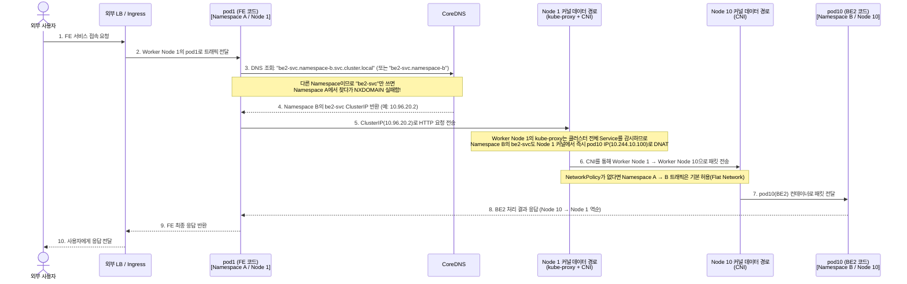
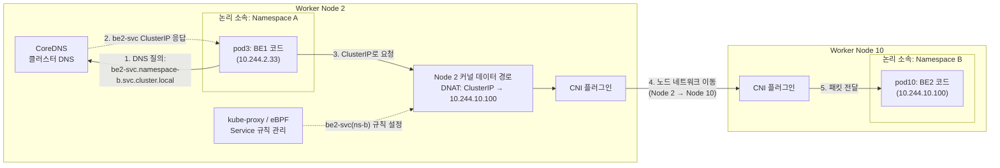
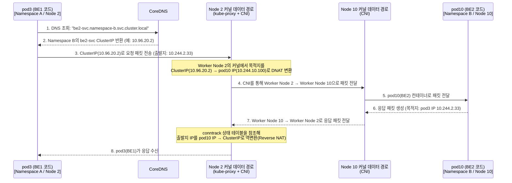

# Kubernetes 멀티 노드 · 멀티 네임스페이스 통신 구조

이 문서는 클러스터 내 서로 다른 **논리적 공간(Namespace A, B)**과 **물리적 실행 환경(Worker Node 1, 2, 10)**에 배치된 Pod들이 어떻게 통신하는지 정리한 문서다.

> **핵심 전제**
>
> - **Namespace(네임스페이스)**는 리소스 이름 범위, Service DNS 도메인, 권한(RBAC), 네트워크 정책(NetworkPolicy)을 구분하는 **논리적 경계**다. 물리적인 라우터나 별도의 노드가 아니다.
> - **Worker Node(워커 노드)**는 실제 컨테이너 프로세스와 커널 네트워크(CNI, kube-proxy/eBPF 데이터 경로)가 동작하는 **물리/가상 머신**이다.
> - 아래 시나리오에서 `FE가 BE를 호출한다`는 흐름은 클러스터 내부 네트워크 경유 과정을 명확히 보여주기 위해 **FE Pod(`pod1`) 내부의 서버 코드(SSR/Next.js 등) 또는 리버스 프록시(NGINX 등)가 클러스터 내부에서 BE를 호출하는 기준**으로 설명한다. *(참고: 만약 브라우저에 내려간 정적 SPA JS가 직접 호출한다면, 클러스터 내부 동서 통신이 아니라 외부 사용자 브라우저 → Ingress → BE 순서로 진입한다.)*

---

## 0. 전체 배치 구조 (논리적 Namespace vs 물리적 Worker Node)

| 구분                | Pod 이름  | 역할 (코드)        | 논리적 소속 (Namespace)          | 물리적 실행 위치 (Node)  | 연결된 Service (예시)  |
| ------------------- | --------- | ------------------ | -------------------------------- | ------------------------ | ---------------------- |
| **Frontend**  | `pod1`  | **FE 코드**  | **Namespace A** (`ns-a`) | **Worker Node 1**  | `fe-svc` (`ns-a`)  |
| **Backend 1** | `pod3`  | **BE1 코드** | **Namespace A** (`ns-a`) | **Worker Node 2**  | `be1-svc` (`ns-a`) |
| **Backend 2** | `pod10` | **BE2 코드** | **Namespace B** (`ns-b`) | **Worker Node 10** | `be2-svc` (`ns-b`) |

- 점선(`-.->`)은 실제 네트워크 홉이 아니라 **Service가 어떤 Pod를 백엔드(EndpointSlice)로 가리키는지**를 뜻하는 논리적 연결이다.

---

## 1. 사용자가 FE로 접속하고, FE가 BE1 코드를 호출하는 경우

- **특징**: 외부 진입(North-South) 후 **같은 네임스페이스(`Namespace A`) 내부, 서로 다른 워커 노드(`Worker Node 1` → `Worker Node 2`) 간 통신**이다.
- **DNS 특징**: `pod1`과 `be1-svc`가 모두 **Namespace A**에 속하므로, `pod1`은 짧은 서비스 이름(`http://be1-svc`)만으로 호출할 수 있다.

### 1-1. 데이터 경로 구조도 (Flowchart)

### 1-2. 단계별 호출 흐름 (Sequence Diagram)

### 1-3. 핵심 포인트

1. **같은 Namespace 내 DNS 축약**: `pod1`의 `/etc/resolv.conf`에는 `search namespace-a.svc.cluster.local svc.cluster.local cluster.local`이 기본 설정되어 있다. 따라서 코드에서 `http://be1-svc`만 호출해도 자동으로 `be1-svc.namespace-a.svc.cluster.local`로 해석된다.
2. **Service는 프록시 서버를 거치지 않음**: `be1-svc`라는 별도 컨테이너를 경유하는 것이 아니라, 출발지 노드인 **Worker Node 1의 커널 데이터 경로**에서 곧바로 `pod3`의 Pod IP로 목적지가 변환(DNAT)되어 **Worker Node 2**로 직행한다.

---

## 2. 사용자가 FE로 접속하고, FE가 BE2 코드를 호출하는 경우

- **특징**: 외부 진입 후 **서로 다른 네임스페이스(`Namespace A` → `Namespace B`)이자 서로 다른 워커 노드(`Worker Node 1` → `Worker Node 10`) 간 통신**이다.
- **DNS 특징**: 대상이 다른 네임스페이스(`Namespace B`)에 있으므로 **반드시 네임스페이스를 명시한 주소(`be2-svc.namespace-b` 또는 `be2-svc.namespace-b.svc.cluster.local`)**로 호출해야 한다.
- **네트워크 특징**: 네임스페이스가 달라도 별도의 "네임스페이스 게이트웨이"를 거치지 않는다. 커널과 CNI 수준에서는 **Worker Node 1에서 Worker Node 10으로 직접 전달**된다.

### 2-1. 데이터 경로 구조도 (Flowchart)

### 2-2. 단계별 호출 흐름 (Sequence Diagram)

### 2-3. 핵심 포인트

1. **다른 Namespace 호출 시 DNS 주소 규칙**:
   - ❌ `http://be2-svc`: `be2-svc.namespace-a.svc.cluster.local`을 찾게 되어 실패한다.
   - ⭕ `http://be2-svc.namespace-b`: `/etc/resolv.conf`의 두 번째 검색 도메인인 `svc.cluster.local`과 결합되어 성공한다.
   - ⭕ `http://be2-svc.namespace-b.svc.cluster.local`: 전체 정규화 도메인(FQDN)으로 가장 명확하며 불필요한 DNS 검색 시도를 줄일 수 있다.
2. **kube-proxy의 범위는 클러스터 전체**: `Worker Node 1`에는 `Namespace B`의 Pod가 하나도 없더라도, `Worker Node 1`의 `kube-proxy`(또는 eBPF)는 `Namespace B`의 Service와 EndpointSlice 정보를 이미 알고 있어 `Worker Node 1` 커널에서 바로 `pod10`으로 DNAT한다.

---

## 3. BE1 코드가 BE2를 호출하는 경우

- **특징**: 외부 사용자 진입이 아닌 **클러스터 내부 백엔드 간(East-West) 통신**이다.
- **배치 관계**: `Namespace A`의 `Worker Node 2`에 있는 `pod3`(BE1)가 `Namespace B`의 `Worker Node 10`에 있는 `pod10`(BE2)을 호출한다.
- **데이터 경로**: `Worker Node 1`을 전혀 거치지 않고, 출발지인 **`Worker Node 2`의 커널 데이터 경로에서 DNAT된 후 `Worker Node 10`으로 직접 이동**한다.

### 3-1. 데이터 경로 구조도 (Flowchart)

### 3-2. 단계별 호출 흐름 (Sequence Diagram)

### 3-3. 핵심 포인트

1. **내부 서비스 간 직접 통신(East-West Traffic)**: 클러스터 내부의 `pod3`가 `pod10`을 부를 때는 외부 Ingress나 LoadBalancer로 나갔다 들어오지 않고, `ClusterIP` Service를 통해 **Worker Node 2 → Worker Node 10**으로 곧바로 통신한다.
2. **conntrack과 역변환(Reverse NAT)**: `pod3`는 `ClusterIP(10.96.20.2)`로 패킷을 보냈지만 실제 응답은 `pod10(10.244.10.100)`이 보낸다. 이때 출발지 노드(`Worker Node 2`)의 커널 `conntrack`이 연결 기록을 기억하고 있다가 응답 패킷의 출발지를 다시 `ClusterIP`로 되돌려주므로, `pod3`의 소켓은 정상적으로 응답을 받는다.
3. **NetworkPolicy로 접근 제어 시**: 만약 `Namespace B`의 `pod10`(BE2)이 오직 `Namespace A`의 `pod3`(BE1)로부터의 호출만 허용하고 `pod1`(FE)의 직접 호출(시나리오 2)은 차단하고 싶다면, `Namespace B`에 `NetworkPolicy`를 생성하여 `namespaceSelector`(Namespace A)와 `podSelector`(`app: be1`)를 함께 지정하면 된다.

---

## 4. 세 가지 경우 한눈에 비교 요약

| 비교 항목                        | 1. 사용자 → FE(`pod1`) → BE1(`pod3`)     | 2. 사용자 → FE(`pod1`) → BE2(`pod10`)    | 3. BE1(`pod3`) → BE2(`pod10`)           |
| -------------------------------- | ---------------------------------------------- | ---------------------------------------------- | -------------------------------------------- |
| **트래픽 성격**            | 외부 진입(North-South) 후 내부 호출(East-West) | 외부 진입(North-South) 후 내부 호출(East-West) | 순수 내부 백엔드 간 호출(East-West)          |
| **출발지 → 목적지 Pod**   | `pod1` → `pod3`                           | `pod1` → `pod10`                          | `pod3` → `pod10`                        |
| **Namespace 변화**         | **같은 Namespace** (`A` → `A`)      | **다른 Namespace** (`A` → `B`)      | **다른 Namespace** (`A` → `B`)    |
| **Worker Node 경로**       | **Node 1 → Node 2**                     | **Node 1 → Node 10**                    | **Node 2 → Node 10**                  |
| **권장 호출 도메인 (DNS)** | `be1-svc` (짧은 이름 가능)                   | `be2-svc.namespace-b.svc.cluster.local`      | `be2-svc.namespace-b.svc.cluster.local`    |
| **DNAT 수행 위치**         | Worker Node 1 커널                             | Worker Node 1 커널                             | Worker Node 2 커널                           |
| **NetworkPolicy 격리 시**  | 같은 Namespace 내`podSelector`로 제어        | `namespaceSelector` + `podSelector` 필요   | `namespaceSelector` + `podSelector` 필요 |
