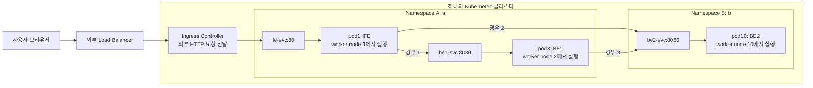
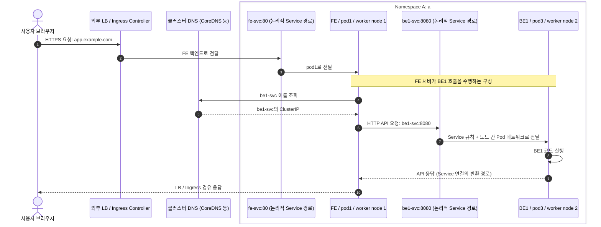
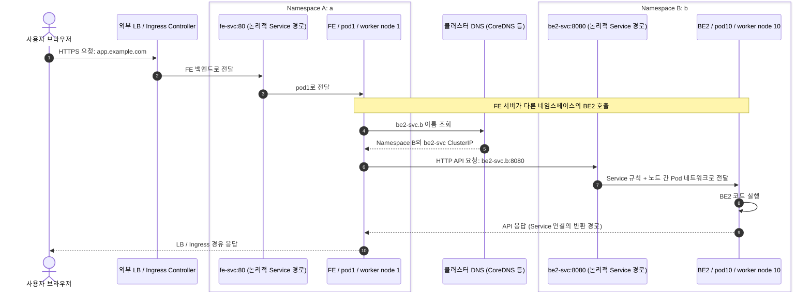
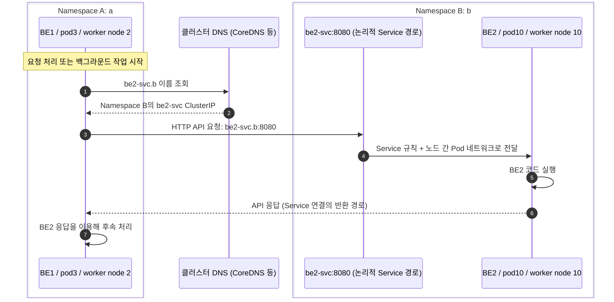

# Kubernetes: FE, BE1, BE2 호출 흐름

요청한 세 경우를 각각 Mermaid 시퀀스 다이어그램으로 정리했다. 기본 그림은 **FE Pod의 서버 코드 또는 리버스 프록시가 BE를 호출하는 구성**이다. 브라우저에서 실행되는 FE JavaScript가 직접 호출하는 구성은 뒤에서 별도로 설명한다.

## 공통 구성

| 애플리케이션 | 네임스페이스 | 실행 노드 | Pod | 예시 Service |
| --- | --- | --- | --- | --- |
| FE | A (`a`) | worker node 1 | pod1 | `fe-svc` |
| BE1 | A (`a`) | worker node 2 | pod3 | `be1-svc` |
| BE2 | B (`b`) | worker node 10 | pod10 | `be2-svc` |

- 세 워커 노드는 같은 Kubernetes 클러스터에 있다고 가정한다.
- A/B는 설명용 이름이며, 실제 네임스페이스 이름은 소문자 `a`/`b`로 가정한다.
- Service는 일반적인 ClusterIP이고, Service 포트는 FE `80`, BE1/BE2 `8080`으로 가정한다. 각 Service는 표에 있는 Pod를 백엔드로 선택한다.
- 외부 사용자는 `https://app.example.com`으로 접속하며, 외부 로드 밸런서와 설치된 Ingress Controller를 거쳐 FE에 도달하는 예시다.
- 네트워크와 정책이 해당 통신을 허용하고, Pod가 준비된 정상 흐름을 나타낸다.

**네임스페이스는 노드를 포함하는 물리적 경계가 아니다.** Pod와 Service는 네임스페이스에 속하고, Node는 클러스터 범위 리소스다. 따라서 아래 그림은 네임스페이스별로 Pod를 묶고 실행 노드를 각 Pod에 표시했다. [Kubernetes Namespaces](https://kubernetes.io/docs/concepts/overview/working-with-objects/namespaces/)

화살표는 요청 경로이며 응답은 생략했다. Service는 논리적 목적지로 표현했다. 별도의 Service 프록시 Pod가 있다는 뜻은 아니며, 실제 전달은 kube-proxy가 구성한 규칙 또는 대체 구현이 처리한다. 노드 간 연결은 CNI 기반 Pod 네트워크를 이용한다. [Kubernetes 네트워크](https://kubernetes.io/docs/concepts/services-networking/)

## 1. 사용자 → FE → BE1: 같은 네임스페이스, 다른 노드

**pod1의 FE 서버가 `http://be1-svc:8080`으로 호출한다.** 같은 네임스페이스이므로 Service 이름만으로 찾을 수 있다. 전체 이름은 `be1-svc.a.svc.cluster.local`이다. 여기서 클러스터 DNS 도메인은 `cluster.local`이라고 가정한다. [Service DNS](https://kubernetes.io/docs/concepts/services-networking/dns-pod-service/)

DNS 응답은 캐시될 수 있어 매 요청마다 DNS 패킷이 발생하지는 않는다.

같은 네임스페이스여도 pod1과 pod3은 서로 다른 Pod이므로 `localhost`로 호출하지 않는다. 실제 트래픽은 worker node 1에서 worker node 2로 전달된다.

## 2. 사용자 → FE → BE2: 다른 네임스페이스, 다른 노드

**pod1의 FE 서버가 `http://be2-svc.b:8080`으로 호출한다.** 대상 네임스페이스 `b`를 포함해야 A의 `be2-svc`와 구분할 수 있다. 전체 이름은 `be2-svc.b.svc.cluster.local`이다. [다른 네임스페이스의 Service 검색](https://kubernetes.io/docs/concepts/services-networking/dns-pod-service/)

이 경로에서는 BE1을 거치지 않는다. FE → BE2 통신에 외부 Ingress를 다시 거칠 필요도 없다. worker node 1에서 worker node 10으로 클러스터 내부 네트워크를 통해 전달한다.

## 3. BE1 → BE2: 서버 간 호출, 다른 네임스페이스

**pod3의 BE1 코드가 `http://be2-svc.b:8080`으로 호출한다.** BE1이 이미 요청을 받았거나 작업을 수행하는 시점부터 나타낸다. 이 호출 자체에는 사용자 브라우저나 FE가 참여하지 않는다.

실제 노드 간 이동은 worker node 2 → worker node 10이다. 경우 1의 요청을 처리하다 BE1이 BE2를 호출한다면 전체 애플리케이션 흐름은 `사용자 → FE → BE1 → BE2`가 된다.

## 브라우저의 FE JavaScript가 BE를 직접 호출한다면

React/Vue 등으로 만든 FE가 정적 파일로 제공되는 구성에서는 pod1이 HTML/JavaScript를 전달하고, 내려받은 JavaScript는 **사용자 브라우저에서 실행**된다. 이때 API 요청의 출발지는 pod1이 아니라 브라우저다.

| 경우 | 브라우저 직접 호출 경로 예시 |
| --- | --- |
| 1: FE JavaScript → BE1 | 브라우저 → `https://app.example.com/api/be1` → 외부 진입점 → A의 `be1-svc` 백엔드 → pod3 |
| 2: FE JavaScript → BE2 | 브라우저 → `https://app.example.com/api/be2` → 외부 진입점 → B의 `be2-svc` 백엔드 → pod10 |
| 3: BE1 → BE2 | 위 서버 간 다이어그램과 동일 |

이 예시는 `/`는 FE, `/api/be1`은 BE1, `/api/be2`는 BE2로 전달하도록 외부 라우팅을 구성한 경우다. 외부 브라우저는 일반적으로 클러스터 내부 DNS 이름이나 ClusterIP에 직접 접근할 수 없으므로, 브라우저 코드에 `http://be2-svc.b:8080` 같은 내부 주소를 넣지 않는다. [ClusterIP와 외부 접근](https://kubernetes.io/docs/concepts/services-networking/service/)

일반 Ingress의 Service 백엔드는 그 Ingress와 같은 네임스페이스에 둔다. 위 경로를 Ingress로 구현한다면 A에는 FE/BE1용 Ingress, B에는 BE2용 Ingress를 두고, 컨트롤러가 두 네임스페이스의 규칙을 처리하도록 구성할 수 있다. 이는 하나의 A Ingress가 B의 Service를 직접 참조한다는 의미가 아니다. [Ingress 규칙](https://kubernetes.io/docs/concepts/services-networking/ingress/)

## 세 경우의 차이

| 경우 | BE 호출 주체: 기본 그림 | 목적지 주소 | 내부 노드 간 이동 |
| --- | --- | --- | --- |
| 1 | FE 서버: pod1, A | `http://be1-svc:8080` | worker node 1 → 2 |
| 2 | FE 서버: pod1, A | `http://be2-svc.b:8080` | worker node 1 → 10 |
| 3 | BE1 서버: pod3, A | `http://be2-svc.b:8080` | worker node 2 → 10 |

네임스페이스가 다르다는 이유만으로 통신이 자동 차단되지는 않는다. NetworkPolicy로 송신/수신 Pod가 격리되어 있다면 해당 방향의 허용 규칙이 필요하며, 이 정책을 지원하는 네트워크 플러그인이 실제로 적용해야 한다. 같은 네임스페이스의 경우 1도 정책에 따라 차단될 수 있다. [NetworkPolicy 동작](https://kubernetes.io/docs/concepts/services-networking/network-policies/)

위 다이어그램은 논리적 흐름이다. Ingress Controller가 ClusterIP를 이용할지 Pod IP로 직접 전달할지, 노드 간에 오버레이를 이용할지 직접 라우팅할지는 구현에 따라 다르다. 애플리케이션 요청마다 API Server나 etcd를 거치지는 않는다.
