# Kubernetes 전체 구조

Kubernetes는 **Control Plane이 원하는 상태를 관리하고, 각 Node가 Pod를 실행하는 구조**다. 사용자가 YAML로 원하는 상태를 등록하면 Kubernetes가 실제 상태를 계속 맞춘다.

아래 그림은 일반적인 Linux 기반 클러스터의 개념도다. 실제 배치, 네트워크 구현, pause 컨테이너 사용 여부는 런타임과 플러그인에 따라 달라질 수 있다.

## 1. 클러스터 구성

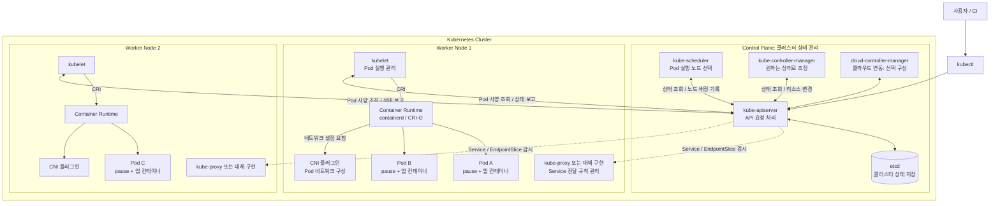

화살표는 관리 관계와 API 통신을 나타낸다. 앱의 패킷이 API 서버나 kubelet을 거쳐 전달된다는 의미는 아니다. Control Plane도 서버인 노드 위에서 실행되며, 위 그림은 역할을 기준으로 구분했다.

| 구성 요소 | 주요 역할 |
| --- | --- |
| kube-apiserver | Kubernetes API 제공, 인증·인가·Admission 처리, 리소스 조회·변경 |
| etcd | 리소스 사양과 상태 등 클러스터 데이터 저장 |
| kube-scheduler | 아직 배정되지 않은 Pod에 적합한 노드 선택 |
| kube-controller-manager | 복제본 수 등 원하는 상태와 실제 상태를 맞추는 컨트롤러 실행 |
| kubelet | 자기 노드의 Pod 실행·상태·프로브 관리 |
| Container Runtime | 이미지 준비와 컨테이너 생성·실행·종료 |
| CNI 플러그인 | Pod 네트워크 연결 구성. IP 할당과 라우팅 등의 구현은 플러그인에 따라 다름 |
| kube-proxy / 대체 구현 | Service 주소로 온 트래픽을 백엔드 Pod로 전달하도록 규칙 구성 |
| CoreDNS | Service 이름 등을 IP로 해석하는 클러스터 DNS, 보통 Pod로 실행 |

스케줄러가 kubelet을 직접 호출해 Pod를 실행시키는 것은 아니다. 스케줄러가 API에 노드 배정을 기록하면 해당 노드의 kubelet이 이를 감지한다. [공식 구성 요소 설명](https://kubernetes.io/docs/concepts/overview/components/)

## 2. Deployment에서 Pod가 실행되기까지

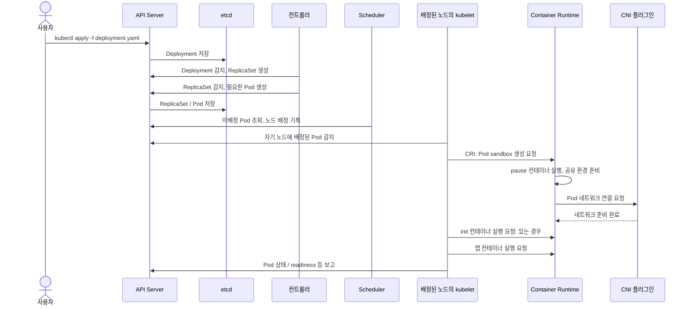

이 그림은 정상적인 시작 흐름을 단순화했다. 컨트롤러는 API Server를 통해 리소스를 변경하며 etcd를 직접 수정하지 않는다. Pod의 네트워크 준비 후 일반 init 컨테이너가 완료되면 앱 컨테이너가 시작된다. readiness가 성공하면 Service의 일반적인 트래픽 대상이 될 수 있다. [Pod 생명주기](https://kubernetes.io/docs/concepts/workloads/pods/pod-lifecycle/)

## 3. Pod 내부와 pause 컨테이너

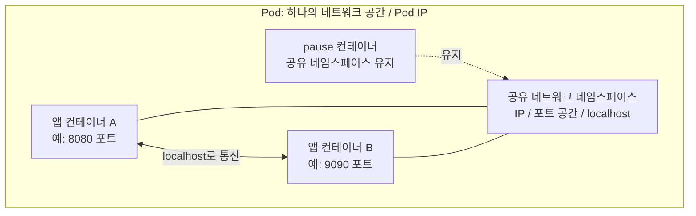

- pause는 앱보다 먼저 실행되어 Pod의 공유 환경을 유지한다.
- 앱 컨테이너들은 네트워크 네임스페이스를 공유하므로 같은 IP와 포트 공간을 사용한다. 같은 주소·포트에 동시에 바인딩하면 충돌할 수 있다.
- pause는 패킷을 중계하는 프록시가 아니다. 일반적인 Linux 환경에서 실제 패킷 처리는 커널이 수행한다.
- 앱 컨테이너 하나가 재시작되어도 sandbox가 유지되면 공유 네트워크 환경도 유지된다.

pause는 보통 Pod YAML의 `spec.containers`에 직접 작성하지 않고 런타임이 관리한다. [containerd의 sandbox 설명](https://github.com/containerd/containerd/blob/main/docs/sandbox-api.md)

## 4. 실제 통신과 Service

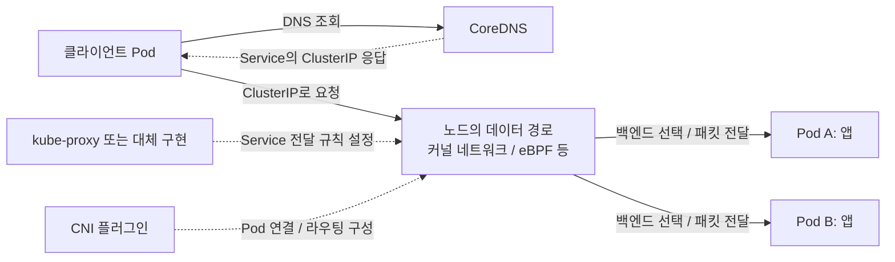

실선은 요청 흐름, 점선은 이름 해석 결과나 설정 관계다. 그림은 일반적인 ClusterIP Service를 기준으로 한다.

**Service는 보통 별도의 프록시 컨테이너가 아니다.** 안정적인 주소와 백엔드 선택 기준을 정의하는 API 리소스다. kube-proxy 또는 대체 구현이 이 정의를 실제 전달 규칙으로 만든다. CNI는 Pod 사이의 연결을 구성하며, 일부 네트워크 제품은 Service 처리까지 통합한다.

같은 Pod 안에서는 `localhost`, 다른 Pod로 직접 접근할 때는 `Pod IP`, 여러 Pod를 안정적인 이름으로 접근할 때는 `Service`를 사용한다. 서로 다른 노드 사이의 트래픽은 노드 네트워크를 통과하며, 직접 라우팅·오버레이 등의 방식은 네트워크 구현에 따라 다르다. [공식 네트워크 설명](https://kubernetes.io/docs/concepts/services-networking/)

### 외부 HTTP 요청 예시

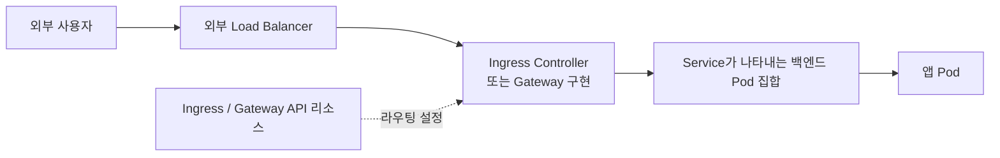

일반적인 HTTP 진입 구성의 개념도다. 실제 구현은 Service의 ClusterIP를 이용하거나 백엔드 Pod IP로 직접 전달할 수 있다. Ingress/Gateway 리소스에는 규칙을 작성하며, 설치된 컨트롤러·게이트웨이 구현이 실제 요청을 처리한다. 외부 접근에는 NodePort나 LoadBalancer Service도 사용할 수 있다. [Service와 외부 접근](https://kubernetes.io/docs/concepts/services-networking/)

### 모드 5: Ingress로 외부 HTTP(S) 요청 전달

**Ingress는 Host·Path별 전달 규칙이며, Ingress Controller가 그 규칙을 실제 프록시나 로드 밸런서 설정에 반영한다.** Ingress 리소스만 생성해도 Controller가 자동 설치되는 것은 아니다. 아래는 기존 모드 5의 `api.example.com`과 두 Service를 사용하는 예시다.

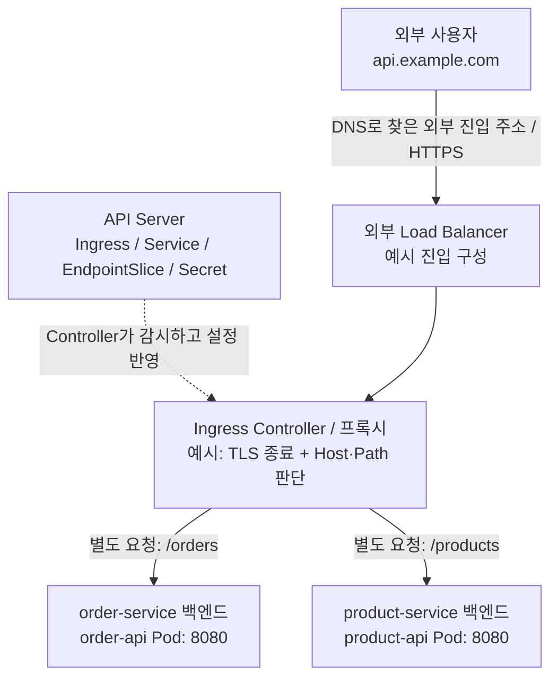

점선은 API 감시·설정 관계이고 실선은 앱 요청이다. 외부 DNS는 클러스터 내부 Service 이름을 해석하는 CoreDNS와 구분한다. 위 예시는 외부 Load Balancer를 사용하지만 Controller 노출 방식은 배포 환경에 따라 다르다.

| 기존 7단계 | 누가 무엇을 하는가 |
| --- | --- |
| 1. Ingress 적용 | 사용자가 YAML을 제출하고 API Server가 규칙을 저장 |
| 2. Controller 감지 | Controller가 담당 Ingress와 Service·EndpointSlice·TLS Secret을 확인 |
| 3. 설정 갱신 | 프록시의 라우팅·인증서 설정 반영. 기존 NGINX 설정 화면은 구현 예시 |
| 4. HTTPS 요청 진입 | 사용자가 외부 진입 주소에 접속하고, 이 예시에서는 Controller가 TLS 종료 |
| 5. `/orders` 라우팅 | Host와 Path가 맞으면 `order-service:8080`의 준비된 백엔드로 전달 |
| 6. `/products` 라우팅 | 다른 요청을 `product-service:8080`의 준비된 백엔드로 전달 |
| 7. 응답 반환 | 선택된 앱의 응답을 프록시가 외부 사용자에게 반환 |

5·6단계는 **서로 다른 요청을 비교하는 분기**다. 한 요청이 orders Pod를 거친 다음 products Pod로 이동하는 순서가 아니다. Service 포트는 `targetPort`를 통해 앱 포트와 연결된다. Controller가 ClusterIP를 이용할지 EndpointSlice의 Pod IP로 직접 전달할지는 구현에 따라 다르다.

YAML에서는 다음 연결을 읽는다.

| 필드 | 의미 |
| --- | --- |
| `spec.ingressClassName` | 처리할 IngressClass 지정. 해당 클래스에 대응하는 Controller 필요 |
| `rules[].host` | HTTP Host 조건. 예시: `api.example.com` |
| `http.paths[].path`, `pathType` | URL 경로 조건. `Prefix`는 경로 요소 기준 접두 일치, `Exact`는 정확한 일치 |
| `backend.service.name`, `port` | 같은 Namespace의 대상 Service와 Service 포트 |
| `tls[].hosts`, `secretName` | TLS 대상 호스트와 인증서·키가 담긴 같은 Namespace의 Secret |

Controller 부재는 규칙이 처리되지 않는 문제, Host·Path 불일치는 대상 규칙을 찾지 못하는 문제, 준비된 백엔드 부재는 앱에 전달할 대상이 없는 문제다. 구체적인 HTTP 응답과 기본 백엔드 동작은 Controller 설정에 따른다. NGINX의 reload 방식이나 TLS 종료 후 백엔드 프로토콜도 모든 구현에 공통인 것으로 설명하지 않는다. [공식 Ingress 설명](https://kubernetes.io/docs/concepts/services-networking/ingress/)

```bash
# 예시 리소스는 default Namespace 기준
kubectl get ingressclass
kubectl describe ingress ecommerce-ingress -n default
kubectl get service order-service product-service -n default
kubectl get endpointslices -n default -l kubernetes.io/service-name=order-service
kubectl get endpointslices -n default -l kubernetes.io/service-name=product-service
kubectl describe secret example-tls-cert -n default

# 외부 DNS와 신뢰할 수 있는 TLS 인증서가 준비된 실제 환경에서 두 요청 비교
curl -i https://api.example.com/orders
curl -i https://api.example.com/products
```

## 5. 주요 리소스의 관계

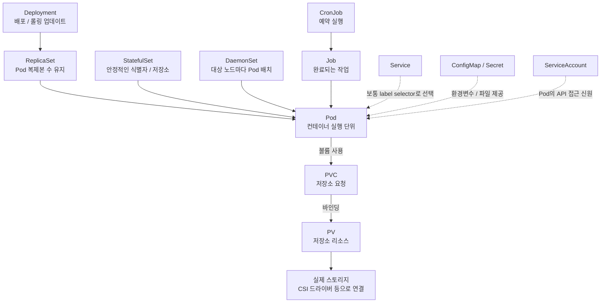

위 그림은 여러 워크로드 종류를 비교한 것이다. 한 Pod가 Deployment, StatefulSet, DaemonSet 모두에 의해 동시에 관리된다는 뜻은 아니다.

| 분류 | 기억할 관계 |
| --- | --- |
| 실행 | Node 위에 Pod가 실행되고 Pod 안에 컨테이너가 존재 |
| 배포 관리 | Deployment → ReplicaSet → Pod |
| 통신 | Service가 Pod 집합에 안정적인 접근 주소 제공 |
| 설정 | ConfigMap은 설정 데이터, Secret은 민감한 데이터 제공 |
| 저장소 | Pod가 PVC를 참조하고 PVC가 PV에 연결 |
| 접근 제어 | ServiceAccount가 신원, Role/ClusterRole이 권한, Binding이 둘을 연결 |
| 논리적 구분 | Namespace가 이름과 정책 적용 범위를 구분하며 물리적인 노드는 아님 |

ServiceAccount만 지정한다고 권한이 생기지는 않는다. RBAC Binding 등을 통해 권한을 부여한다. Secret은 이름만으로 저장 시 암호화가 보장되는 것은 아니며 클러스터 설정에 따라 달라진다.

### 모드 4: PVC와 외부 스토리지

**PVC는 Pod가 필요한 저장소를 요청하는 리소스이고, PV는 실제 저장소와 연결되는 클러스터 리소스다.** StorageClass는 동적 생성에 사용할 프로비저너와 정책을 정의한다. 기존 PV를 연결하는 정적 방식도 가능하다. 기존 모드 4는 AWS EBS CSI 드라이버를 통한 동적 생성 예시다.

| 구성 요소 | 역할 |
| --- | --- |
| PVC: `mysql-data-pvc` | Namespace 안에서 20Gi 등 용량·접근 모드·StorageClass 요청 |
| StorageClass: `ebs-gp3-sc` | `ebs.csi.aws.com`과 볼륨 종류·바인딩·회수 정책 정의 |
| PV | PVC와 바인딩되고 CSI 볼륨 식별자 등 실제 저장소 연결 정보 보유 |
| CSI controller와 사이드카 | 볼륨 생성·삭제 및 지원되는 노드 Attach/Detach 조정 |
| CSI node와 kubelet | 해당 노드에서 볼륨 준비·마운트 및 해제 |
| 외부 스토리지: AWS EBS | 앱이 쓰는 실제 데이터 저장. API 리소스인 PV와 구분 |

CSI controller는 cloud-controller-manager와 별도 구성이다. Controller가 반드시 Control Plane 노드에 배치되어야 하는 것은 아니다. EBS의 생성·연결에는 AWS API 접근 권한과 드라이버가 필요하다. [AWS EBS CSI Driver](https://github.com/kubernetes-sigs/aws-ebs-csi-driver)

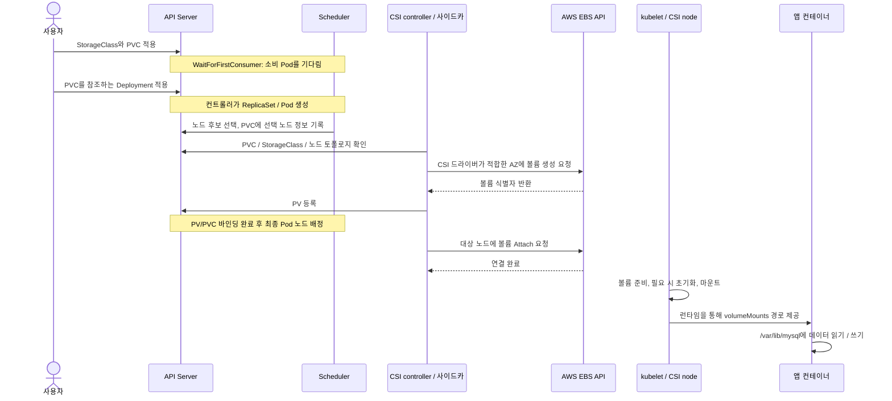

이 그림은 정상 흐름을 단순화한 **저장소 준비 과정**이다. 실제 앱의 디스크 I/O가 API Server를 통과하는 경로를 뜻하지 않는다. `WaitForFirstConsumer`는 소비 Pod의 스케줄링 제약을 고려해 볼륨 생성·바인딩을 늦춘다. 노드 후보 선택과 최종 Pod 배정은 구분하며, CSI 드라이버와 스케줄러가 볼륨 토폴로지를 함께 고려한다. [StorageClass와 볼륨 바인딩](https://kubernetes.io/docs/concepts/storage/storage-classes/)

| 기존 8단계 | 이해할 핵심 |
| --- | --- |
| 1. PVC 접수 | `Pending`은 소비 Pod 대기일 수 있음. 실패 여부는 Events로 확인 |
| 2. Pod 노드 선택 | 노드 자원·AZ·저장소 제약을 고려하고 볼륨 준비 뒤 최종 배정 |
| 3. CSI 프로비저너 | external-provisioner가 요청을 조정하고 CSI 드라이버가 저장소 API 호출 |
| 4. EBS 생성·PV 바인딩 | 실제 볼륨과 PV가 생성되고 PVC가 `Bound`로 전이 |
| 5. Attach | 볼륨을 대상 노드에 연결. VolumeAttachment로 연결 상태 확인 |
| 6. Mount | 노드에 파일시스템을 준비·마운트. 기존 데이터 볼륨은 다시 포맷하지 않음 |
| 7. DB 실행 | Pod의 `volumes[].persistentVolumeClaim.claimName`과 컨테이너의 `volumeMounts`를 연결 |
| 8. 영속성 확인 | 같은 PVC를 참조하는 새 Pod에서 이전 데이터를 읽는 예시 |

`Bound`는 저장소 연결 관계가 성립한 상태이며, 컨테이너 마운트·앱 준비까지 완료했다는 뜻은 아니다. `ReadWriteOnce`는 단일 노드에서 읽기·쓰기할 수 있다는 의미이며 단일 Pod로 제한한다는 뜻은 아니다. 실제 동시 사용 조건은 드라이버와 저장소 기능도 확인해야 한다.

Pod를 삭제해도 PVC/PV가 유지되면 새 Pod가 같은 볼륨을 재사용할 수 있다. PVC 삭제 후에는 PV의 회수 정책에 따라 `Delete`는 외부 볼륨 삭제로 이어질 수 있고, `Retain`은 저장소를 남겨 관리자가 회수하도록 한다. 영속 저장소는 앱이 아직 기록하지 않은 데이터나 모든 장애의 무손실 복구를 보장하지 않는다. [PV·PVC와 접근 모드·회수 정책](https://kubernetes.io/docs/concepts/storage/persistent-volumes/)

```bash
# 예시 PVC와 앱은 default Namespace 기준
kubectl get storageclass ebs-gp3-sc -o yaml
kubectl get pvc mysql-data-pvc -n default
kubectl describe pvc mysql-data-pvc -n default
kubectl get pv
kubectl get volumeattachments

# POD_NAME을 실제 DB Pod 이름으로 변경
kubectl describe pod POD_NAME -n default
kubectl exec POD_NAME -n default -- df -h /var/lib/mysql
```

PVC Events에서는 소비 Pod 대기·프로비저닝을, Pod Events에서는 스케줄링·Attach·Mount 오류를 확인한다. 영속성 실습은 같은 PVC를 유지한 채 앱에서 데이터를 기록하고, 교체된 Pod에서 다시 조회하는 순서로 진행한다. ConfigMap/Secret 파일 제공은 여기서 설명한 EBS의 CSI 생성·Attach 과정과 구분한다.

## 6. Pod 라이프사이클

### Pod의 단계: phase

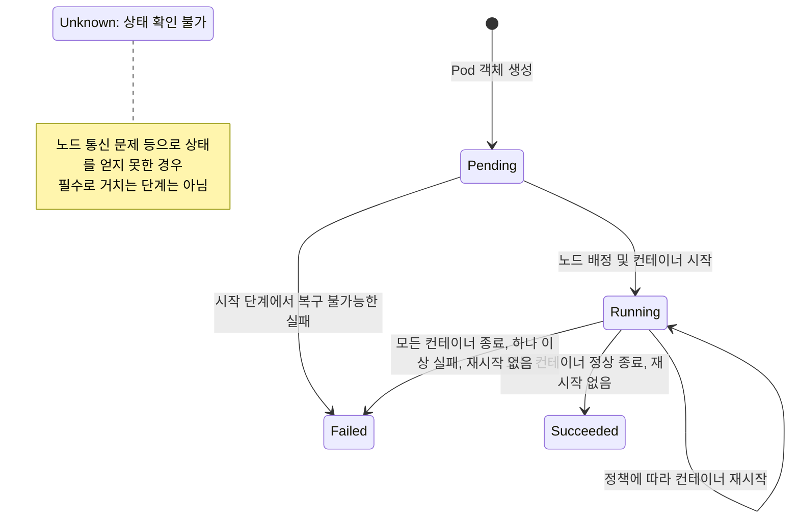

대표 흐름을 단순화한 그림이다. `phase`는 상세한 실행 상태 전체를 표현하지 않는다.

| phase | 의미 |
| --- | --- |
| Pending | 스케줄링 대기, 이미지 다운로드, init 실행 등 시작 준비 중 |
| Running | 컨테이너 생성 완료. 하나 이상 실행 중이거나 시작·재시작 중 |
| Succeeded | 모든 컨테이너가 성공적으로 종료되고 재시작하지 않음 |
| Failed | 모두 종료되었고 하나 이상 실패했으며 재시작하지 않음 |
| Unknown | Pod 상태를 확인할 수 없음 |

**Running이 곧 요청 처리 가능이라는 뜻은 아니다.** `Ready` 조건도 확인해야 한다. `kubectl get pods`의 `STATUS`에 나타나는 `CrashLoopBackOff`, `ImagePullBackOff`, `Terminating`은 별도의 Pod phase가 아니다.

### 준비 상태와 건강 검사

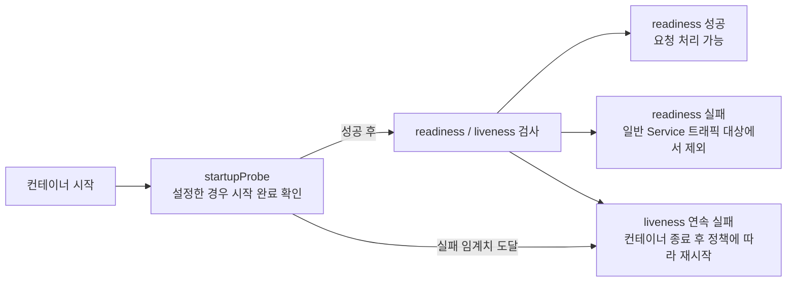

startupProbe가 없으면 readiness/liveness는 각자의 설정에 따라 시작한다. readiness 실패만으로 컨테이너가 재시작되지는 않는다. Pod의 `Ready`는 컨테이너 준비 상태와 readiness gate 등도 반영한다. [공식 프로브 설명](https://kubernetes.io/docs/concepts/workloads/pods/probes/)

### 컨테이너 재시작과 Pod 교체

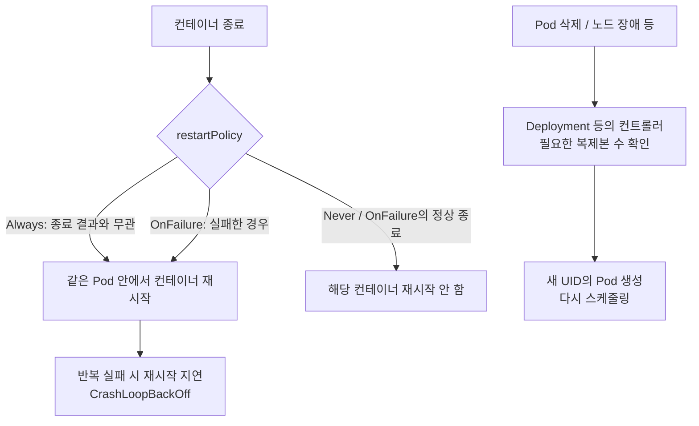

표는 기본 Pod 수준 `restartPolicy` 기준이다. 컨테이너별 정책 등의 확장 설정은 생략했다. **컨테이너 재시작은 같은 Pod, Pod 교체는 새 Pod**다. 기존 Pod가 다른 노드로 이동하지 않는다. 컨트롤러 없이 직접 생성한 Pod에는 자동 교체가 보장되지 않는다.

### 삭제와 정상 종료

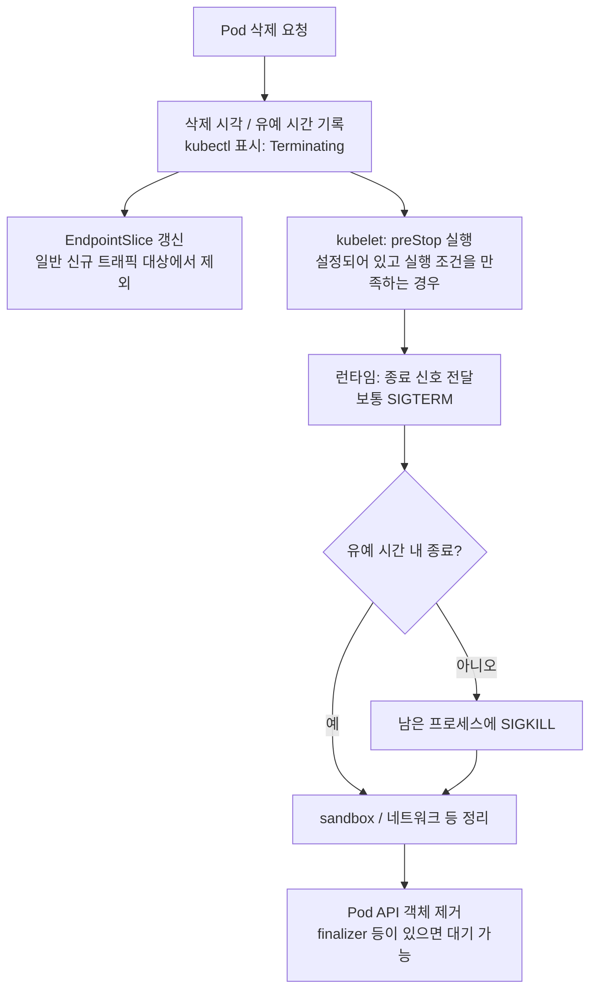

일반적인 삭제 흐름이다. 트래픽 대상 갱신과 노드의 종료 처리는 병행되므로 순간적인 전파 지연이 있을 수 있다. `terminationGracePeriodSeconds` 기본값은 **30초**이며 preStop 실행 시간도 포함한다. 이미지 설정에 따라 종료 신호가 달라질 수 있다. 앱 종료 후 pause와 Pod 네트워크도 정리된다.

종료된 Pod가 항상 즉시 삭제되지는 않는다. 작업 완료 Pod는 `Succeeded`/`Failed`로 남을 수 있다. [공식 Pod 라이프사이클과 종료 설명](https://kubernetes.io/docs/concepts/workloads/pods/pod-lifecycle/)

### 상태 확인 명령

```bash
# READY, STATUS, RESTARTS 확인
kubectl get pods -o wide

# phase와 Ready 조건 확인: POD_NAME을 실제 이름으로 변경
kubectl get pod POD_NAME -o jsonpath='{.status.phase}{"\n"}{.status.conditions[?(@.type=="Ready")].status}{"\n"}'

# 컨테이너 상태, 종료 이유, Events 확인
kubectl describe pod POD_NAME

# 직전에 종료된 컨테이너 로그 확인: 컨테이너가 여러 개면 -c 이름 추가
kubectl logs POD_NAME --previous
```

## 7. 구조를 읽는 핵심

**관리 흐름**: 사용자 → API Server → 상태 저장·컨트롤러·스케줄러 → kubelet → 런타임 → Pod.

**통신 흐름**: 앱 → 노드의 네트워크 데이터 경로 → 대상 앱. Service, CNI, kube-proxy 등은 이 경로를 정의하거나 구성하며 pause는 공유 네트워크 환경을 유지한다.

**저장소 흐름: 모드 4**: Pod → PVC → PV → 외부 스토리지. CSI 구성 요소가 볼륨 생성·연결·마운트를 맡으며 Pod와 데이터의 수명을 구분한다.

**외부 HTTP(S) 흐름: 모드 5**: 외부 사용자 → 진입 주소 → Ingress Controller/프록시 → 선택된 Service의 백엔드 앱. Ingress는 Host·Path·TLS 규칙을 정의한다.

## 참고 문서

- [Kubernetes 구성 요소](https://kubernetes.io/docs/concepts/overview/components/)
- [Kubernetes 개념: 워크로드·설정·저장소·보안](https://kubernetes.io/docs/concepts/)
- [Pod 생명주기](https://kubernetes.io/docs/concepts/workloads/pods/pod-lifecycle/)
- [네트워크와 Service](https://kubernetes.io/docs/concepts/services-networking/)
- [Ingress 규칙과 Controller](https://kubernetes.io/docs/concepts/services-networking/ingress/)
- [PV·PVC와 영속 저장소](https://kubernetes.io/docs/concepts/storage/persistent-volumes/)
- [StorageClass와 볼륨 바인딩](https://kubernetes.io/docs/concepts/storage/storage-classes/)
- [AWS EBS CSI Driver](https://github.com/kubernetes-sigs/aws-ebs-csi-driver)
- [containerd Pod sandbox](https://github.com/containerd/containerd/blob/main/docs/sandbox-api.md)
